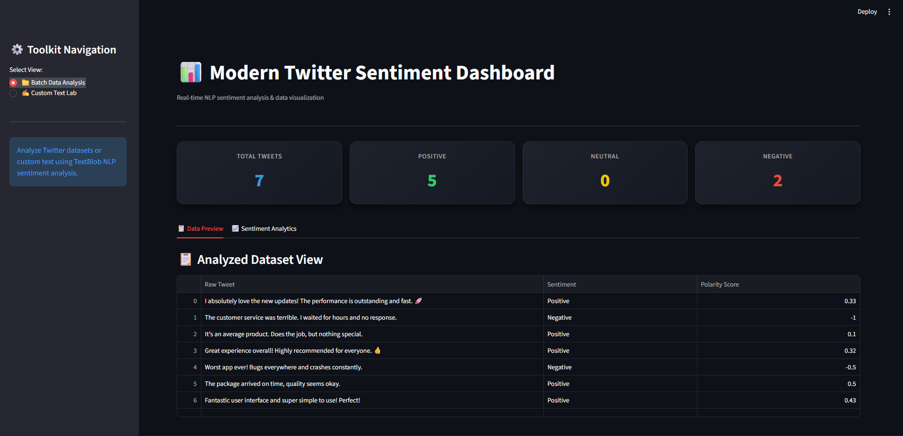
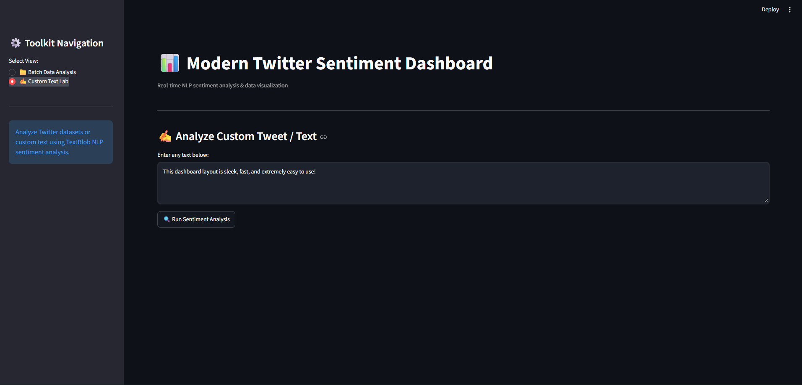

# Real-Time Twitter Sentiment Analysis Dashboard 📊🐤

An attractive, interactive Streamlit NLP application that performs sentiment analysis and text analytics on Twitter data in real time. It uses Natural Language Processing (TextBlob & Regex) to clean tweets, compute sentiment polarity, and generate visual distribution charts.

---

## 🖼️ Dashboard Screenshots

### 1. Batch Data Analysis & Sentiment Analytics


---

### 2. Custom Text Analysis Lab


---

## 🚀 Key Features

* **📁 Batch Data Analysis:** Analyzes multiple tweet datasets simultaneously and displays real-time metrics (Total, Positive, Neutral, Negative).
* **📈 Interactive Visualizations:** Built-in dark mode Seaborn & Matplotlib bar charts showing sentiment distribution.
* **✍️ Custom Text Lab:** Live playground to test individual custom text or tweets with instant polarity scoring.
* **🧹 NLP Preprocessing:** Automatic removal of URLs, hashtags, mentions, retweets, and special characters.

---

## 🛠️ Tech Stack & Dependencies

* **Language:** Python 3.8+
* **Web Framework:** Streamlit
* **NLP & Text Processing:** TextBlob, Re (Regex)
* **Data Processing:** Pandas
* **Data Visualization:** Matplotlib, Seaborn

---

## 📁 Project Structure

```text
Real-Time Sentiment Analysis on Twitter Data/
│
├── app.py                         # Main Streamlit Dashboard Application
├── batch_sentiment_dashboard.png  # Screenshot: Batch Analytics Dashboard View
├── custom_text_lab.png            # Screenshot: Live Text Lab View
├── requirements.txt               # List of required dependencies
└── README.md                      # Project documentation
